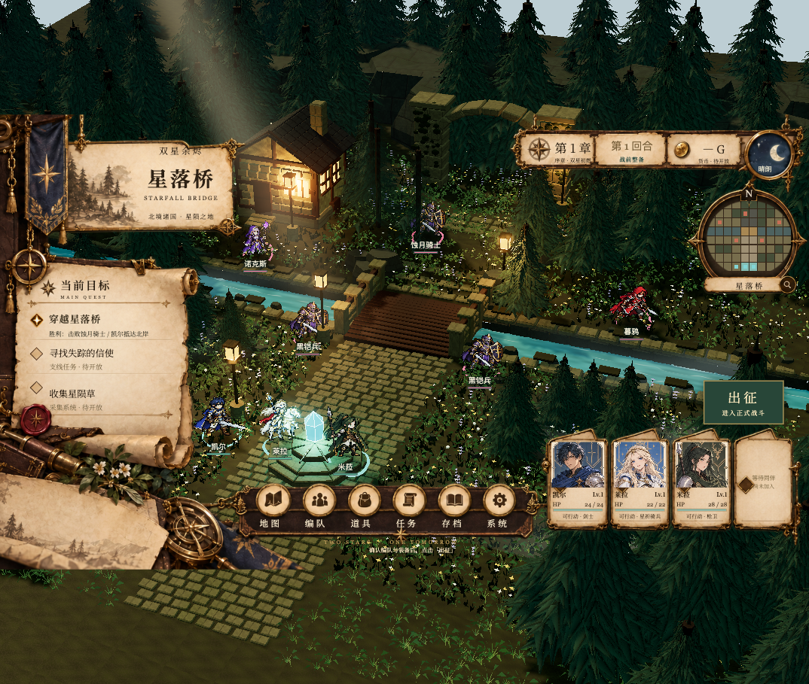
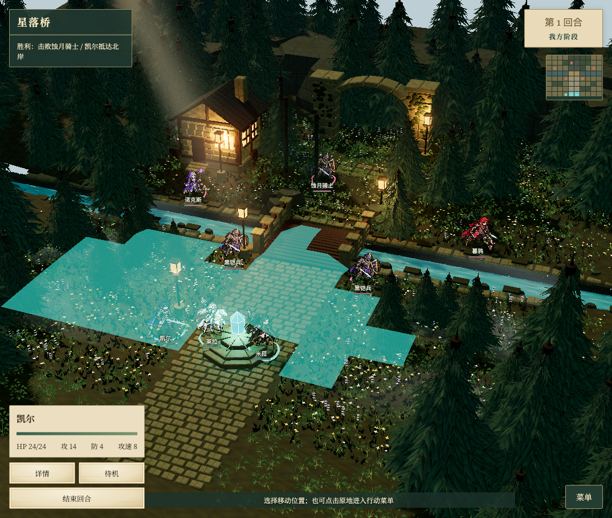
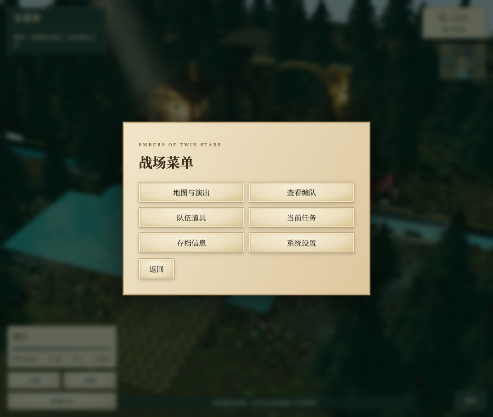
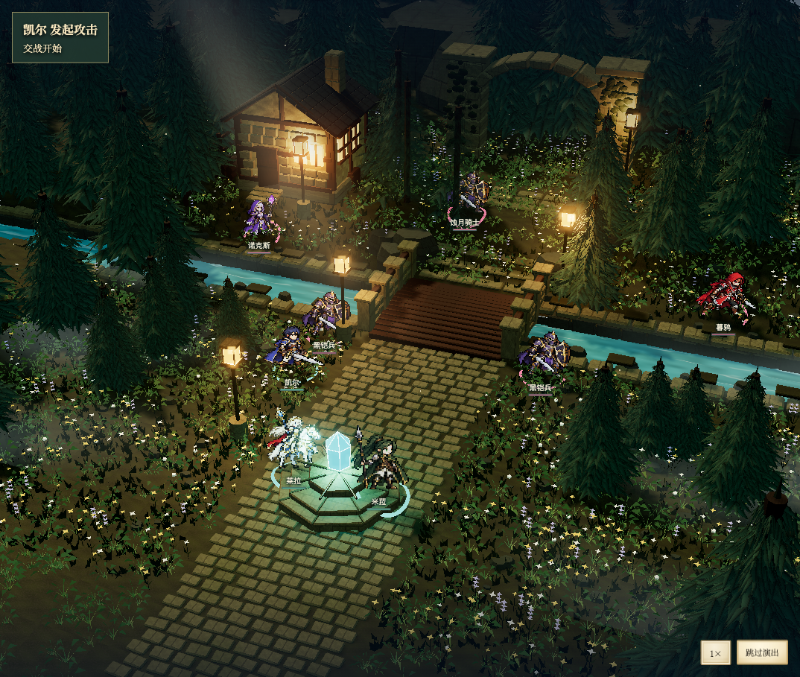
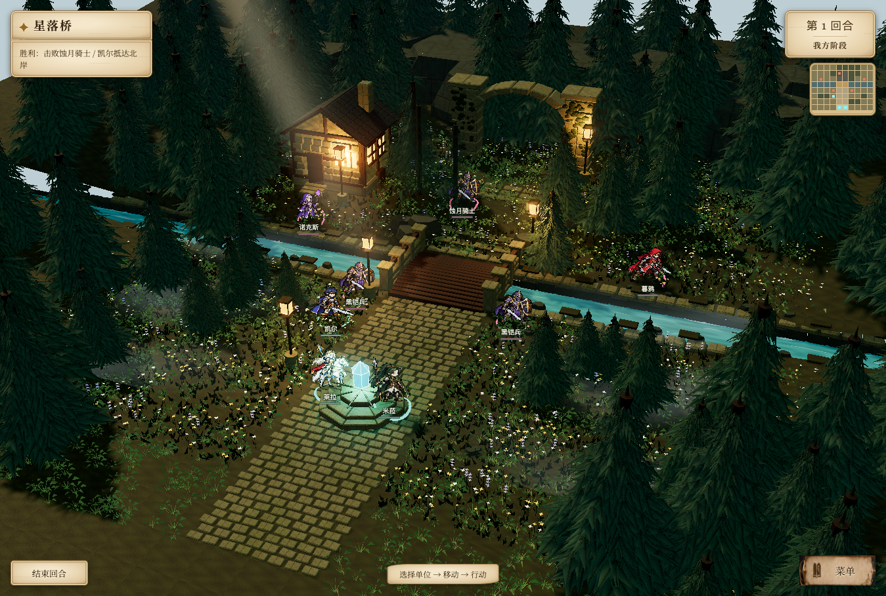
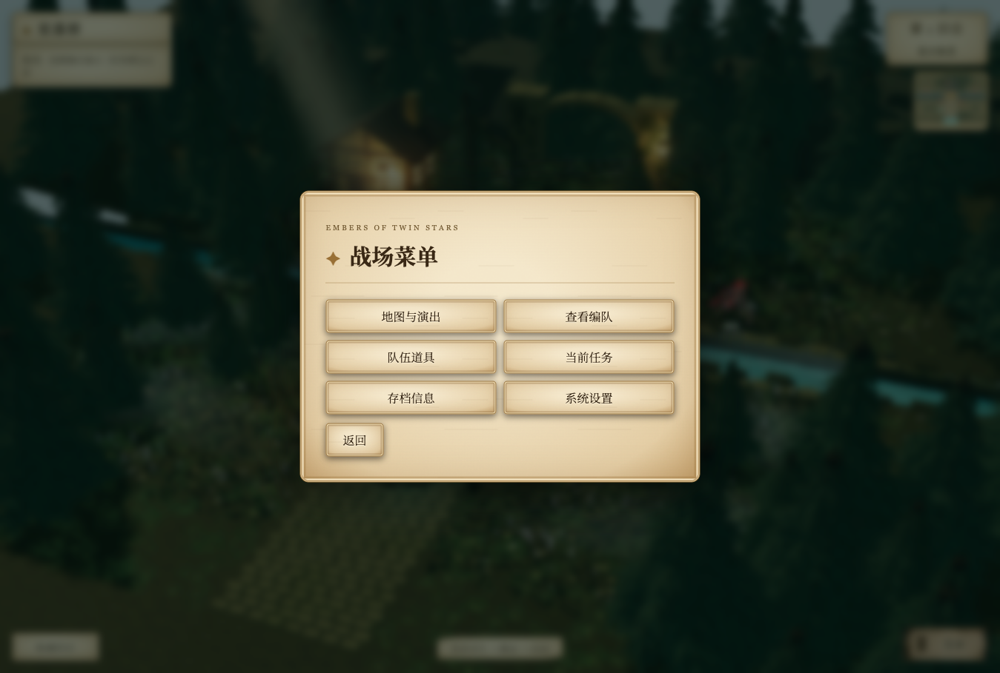
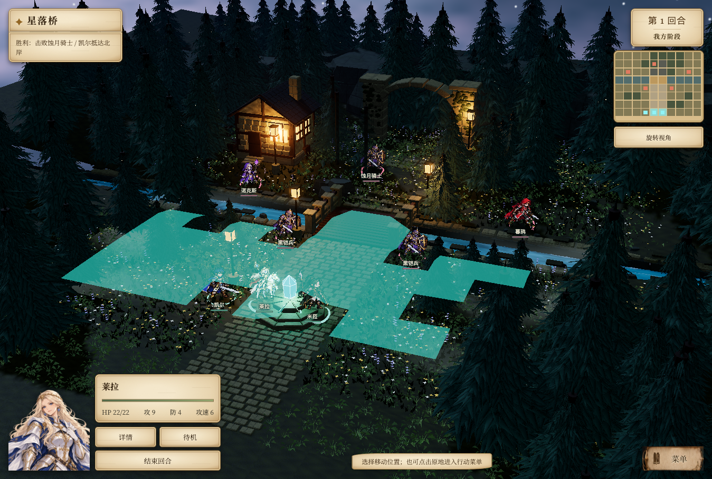
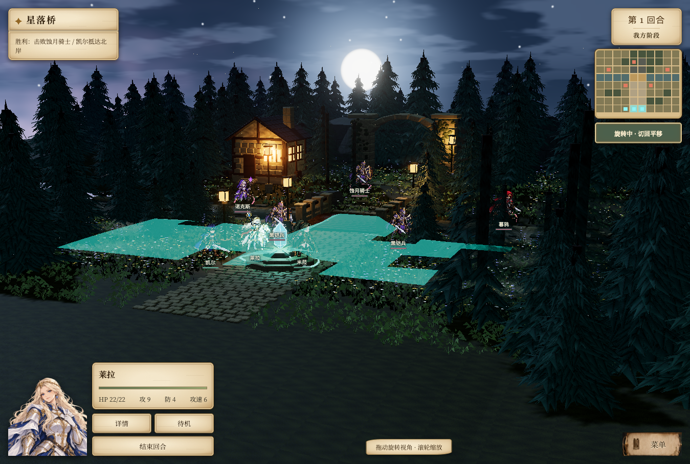

# 战前整备与战斗界面

2026-09-17，按已确认的交互图接入。

## 交互

- 新关卡确认编队后进入战前整备，保留装饰框、底部六项入口和队伍卡片。此时不能移动或结束回合。
- 整备时可重新调整出击角色、部署顺序、装备和魔法；再次打开编队保留已确认的出击选择。道具入口可跳转到装备分配。
- 点击「出征」进入正式战斗，装饰框、底部导航、整队卡片隐藏；目标在左上，回合及小地图在右上，菜单在右下。
- 选择单位后，左下显示简要状态与当前可用操作；资料卡随按钮数量自然排列，避免遮挡中央场景。
- 战场菜单为临时模态窗口，阻止穿透选择地图。编队在战斗中只读；系统设置、角色详情返回时保留原来的行动状态。
- 地图内战斗演出隐藏常规 HUD 和两侧大资料板，仅保留角落结果文字、倍速及跳过。结束后恢复战斗界面。
- 战前刷新继续整备；出征后的自动存档和既有存档进入精简战斗界面。额外 UI 指纹存在独立 localStorage，不改动 v2 战役格式。
- 存档入口显示现有自动保存状态；手动多栏位、未开放支线和采集功能仍为原有占位。

## 验证

- `npm test`：规则、两章、存档兼容、渲染边界及资源检查通过。
- `npm run build`：通过；沿用既有大包体积警告。
- `scripts/playtest-battle-hud.js`：战前不可移动、刷新恢复、出击选择保留、出征隐藏组件、模态阻断地图、只读编队、设置返回、手机移动与取消、敌方回合通过。
- `scripts/playtest-replica.js`：从新游戏经世界地图、村庄、剧情、编队至战场；桌面及手机、设置、角色详情、经典/3D 状态一致、读档恢复通过。报告见 `battle-hud-evidence/replica-report.json`。
- `scripts/playtest-starfall-combat.js`：4 类交战 × 3 种演出，共 12 个组合的伤害、消耗和相机恢复一致。报告见 `battle-hud-evidence/combat-parity.json`。
- 第二章旧档的经典与 3D 界面切换通过；演出时常规 HUD 隐藏、跳过后恢复通过。
- 实际检查 1074×909、1440×900 和 390×844。手机提示与出征按钮、角色资料与行动按钮的边界无重叠；无横向溢出，浏览器运行无异常。

浏览器脚本只使用独立 QA 地址 `http://replica-check.localhost:4174/`，不清理玩家原地址的存档。运行方式：`tabbit-cli nodejs --task <测试任务> --request-id <唯一编号> --timeout-ms 120000 < scripts/playtest-battle-hud.js`。

## 截图

手机截图：`battle-hud-evidence/staging-mobile.png`、`battle-hud-evidence/unit-mobile.png`。

## 羊皮纸视觉修订

出征后的目标、回合、角色状态、行动按钮、菜单及演出提示统一纸纹、深褐文字、旧金边框；菜单入口复用原卷轴按钮素材。底部操作提示改为居中短纸签，继续保留角落布局。1349×909 与 390×844 截图如下。

手机截图：`battle-hud-evidence/parchment-mobile.png`。

## 立绘、星河月夜与自由视角

- 选中角色后在行动面板左侧显示对应立绘；凯尔、莱拉使用已有透明半身立绘，其他角色使用对应肖像。手机缩小为并排布局。
- 小地图桌面由 100×80 放大至 170×136，手机由 76×61 放大至 112×90。
- 星落桥「随地图」默认星河月夜，增加星点、星云光带、月盘与柔和蓝色月光，保留暖色灯火。用户明确选择「日光」时仍使用日景。
- 鼠标右键拖动或 Shift+拖动可旋转；小地图下方「旋转视角」开关启用后，可直接拖动环绕和调整俯仰，触屏也可使用。双指平移、缩放继续保留。
- 水平环绕不设限，俯仰限制在地面以上。平移方向随当前视角变化。战斗演出捕获并恢复朝向、距离和目标点。

验证：`npm test`、`npm run build` 通过；新增完整 360° 环绕、俯仰边界及镜头恢复断言。`scripts/playtest-starry-orbit.js` 验证三人立绘、放大小地图、右键旋转不误选单位、旋转开关及手机不溢出。`scripts/playtest-starfall-combat.js` 在旋转后的镜头下运行 12 个演出组合，结果一致且恢复视角。

