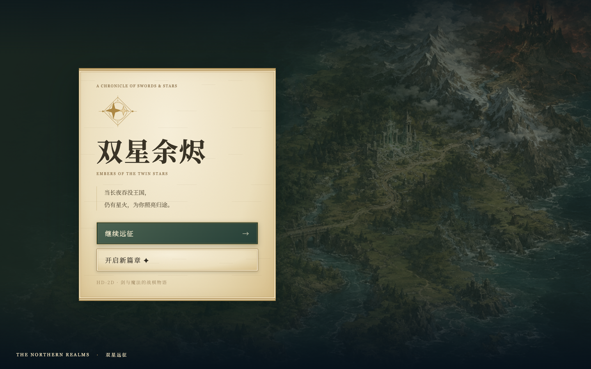
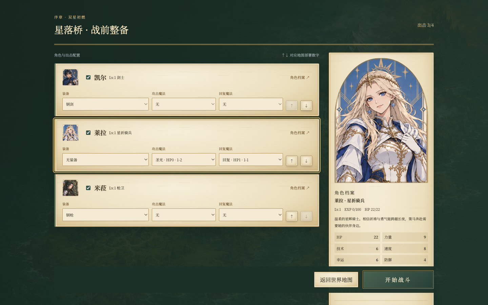
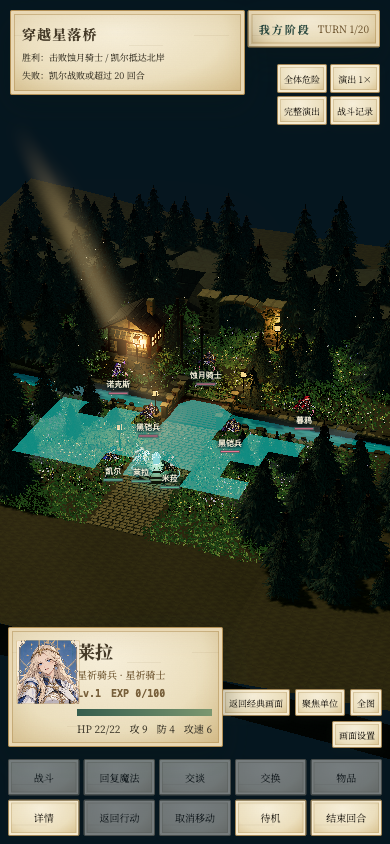

# 双星余烬 · 羊皮纸界面与人物更新

依据用户引用的「修改人物画风」对话及附件实施。读取到的是人物画风、女性骑兵和羊皮纸 UI 的需求与参考图，没有完整 UI 成稿；本轮将其转为游戏实际界面。

## 已落地

- 标题、对话、世界地图目的地、整备、人物详情、行动菜单、战斗预测、设置、成长与结算统一使用暖色羊皮纸、森林墨色、旧金边饰。标题加入双星纹章。
- 对话、整备、详情等大面板首次打开时，从上到下展开，卷轴下沿随展开边缘移动。连续对话和高频战场刷新不反复播放；系统或游戏设置中的减少动态效果均可停用。
- 八张半身像改为统一的绘制风格、纹章背景和金色拱形边框，覆盖对话、整备与详情中的角色。
- 星落桥莱拉改为长浅金发、蓝眼的女性星祈骑兵，保留白马、蓝色法杖及红披风；米菈改为深绿长马尾女性枪卫。两人的待机、行走、蓄力、出手和收势均已同步。
- 完成此前的六套人物动作：每套六帧，共 36 帧；回复施法补齐收势。固定 128×128 透明画布，按人物原像素高度统一缩放，脚底定位，长剑和长枪有足够透明边距。受光、自发光与阴影纹理同步切帧。

角色与 UI 变化均属于表现层；战斗规则、AI、职业、数值、招募和战役存档格式没有改变。Godot 制作工程与经典/第二关原像素素材仍保留；女性像素角色修订应用于本轮的星落桥动画，八张新 UI 半身像在各界面共用。

## 素材与维护

- `public/assets/chronicle/portraits/`：八张半身像；`paper-grain.svg`、`twin-stars.svg` 为代码绘制的纸纹和纹章。
- `public/assets/starfall/animations/`：游戏使用的 36 帧与每套尺寸/哈希清单。
- `docs/chronicle-evidence/source/`：本轮生成的原始半身像图集和两套女性动作图；`generation.json` 保存完整提示词。使用内置 image_gen 生成，未使用 API CLI。
- `docs/starfall-animation-evidence/source/`：其余动作图原稿及早期动作基线；`generation.json` 保存对应完整提示词。
- `scripts/normalize-starfall-animation.py`：只做透明连通区域提取、统一缩放与脚底对齐，不绘制新姿态。女性修订重建时传 `--keep-generated-idle`，避免恢复为旧待机造型。
- `src/chronicle-theme.css`：主题与卷轴视觉；`src/game/ui/chronicle.ts`：只在面板类型变化时触发展开。

## 验收

`npm test` 与生产构建通过。浏览器独立测试域名覆盖真实点击移动、攻击、回复施法与复位；四组固定随机战斗在旧舞台、新地图完整播放、跳过三条路径的结果一致。另检查标题、键盘对话、世界移动至星落桥、整备出战、手机详情、减少动态效果与文字对比度。实测结果保存在 `chronicle-evidence/browser-report.json`。

本轮截图：

