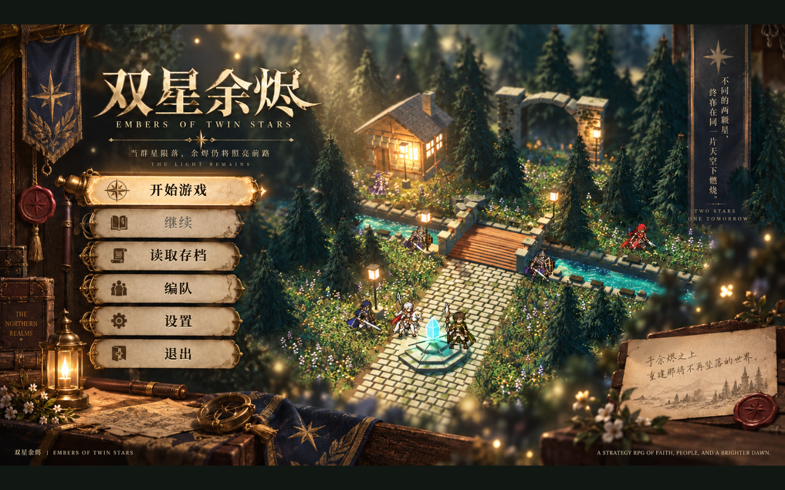
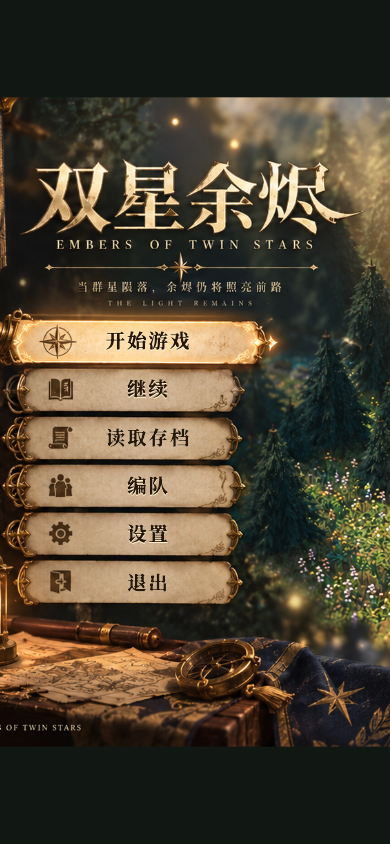
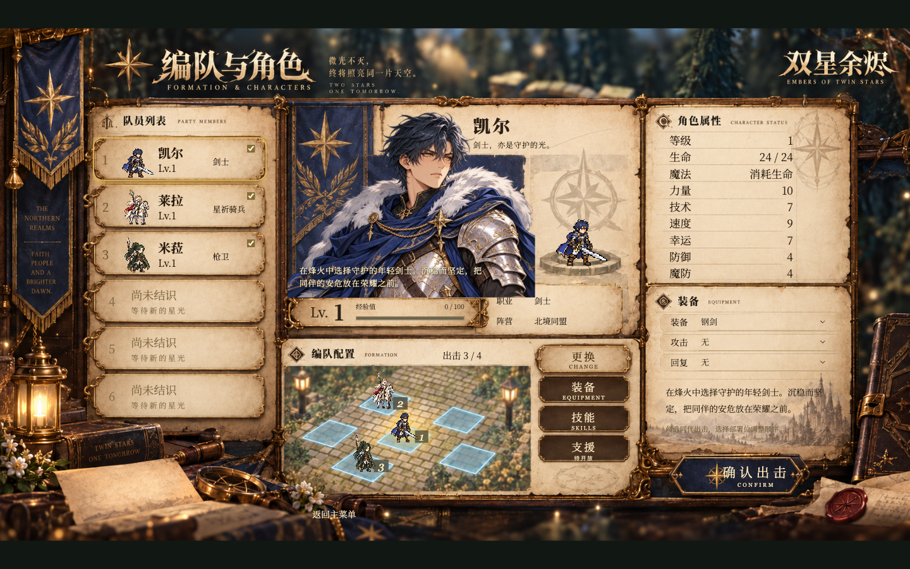
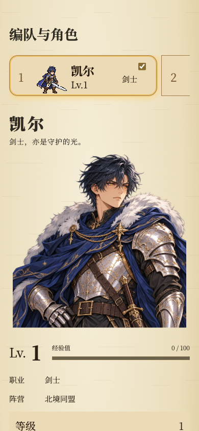
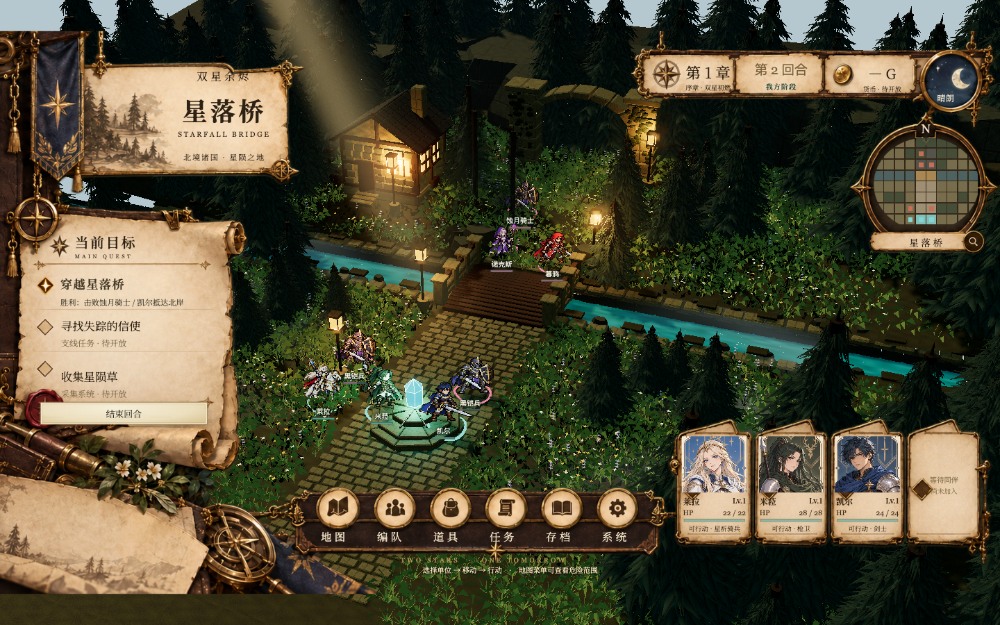
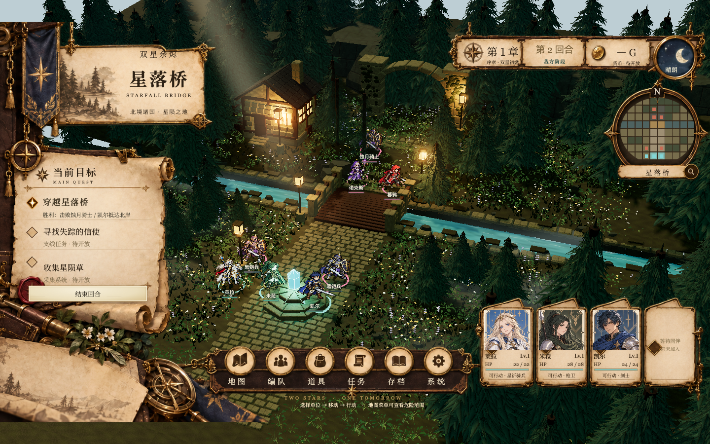

# 三套界面验收与星落桥美术续作（2026-09-17）

## 三套界面

主菜单、编队、战场 HUD 已在 Tabbit Chromium 中完成真实点击与键盘验收。桌面视口 1440×900，手机模拟视口 390×844；测试使用 `replica-check.localhost:4174`，未读写通常游玩地址的存档。

本轮修复：

- 世界地图、村庄退场时显式释放它们注册的按键捕获。原先 Phaser 先销毁 Key 对象却留下全局捕获，导致后续编队和战场原生弹窗无法按 Esc 关闭。已重走“新游戏 → 世界 → 村庄 → 世界 → 编队 → 战场”验证。
- 手机主菜单复用底图对应的按钮位置，去除错位叠加的第二套按钮背景。
- 手机编队使用独立纸纹背景与深色文字，不再把包含标题、属性框的桌面整图当作滚动内容背景。

已验证空档、设置保存、退出说明、剧情键盘推进、角色查看、顺序调整、主角必选、重复装备拦截、出战、只读编队返回、道具/任务/存档弹窗、减少动态效果、经典/3D 切换状态一致、敌方回合和读取存档恢复、取消覆盖旧档；页面脚本错误为 0。

可复跑脚本：`scripts/playtest-replica.js`。记录：[browser-report.json](replica-evidence/browser-report.json)。

| 桌面 | 手机 |
| --- | --- |
|  |  |
|  |  |

## 星落桥场景续作

沿用 `godot-starfall/art-direction/starfall-hd2d-concept-v1.png` 的既有方向，本轮修改浏览器表现层：

- 缩小草叶、降低草丛密度并加入确定性色差，让原有石路、地面和花丛更容易辨认。
- 树冠增加连续世界坐标色差与顶部明度变化；提高白天环境光和曝光，保留夜景光照分档。
- 石路、河岸等石材增加斑驳苔色与轻微明暗变化。
- 河面改为细波和靠岸泡沫层次；降低光束不透明度与橙色浓度。

原 GLB、角色动作、地图规则和存档格式未修改；新增色差不使用战斗随机数。这是一次材质、植被和光照打磨，没有重建树形或实现石块几何破损，也没有宣称达到参考图的完整精度。Godot 工程未同步这些浏览器材质调整。

同构图、同一战役状态、均衡画质下的对照：

战斗回归覆盖命中追击、全未命中、暴击致死、骑兵耗血施法四组场景，每组比较经典舞台、地图完整播放、立即跳过；共 12 条播放路径，结算一致，镜头和临时特效均恢复。记录：[combat-report.json](starfall-polish-evidence/combat-report.json)。

真实点击移动、取消移动和攻击通过；低/中/高三档日夜组合保持单位状态一致；减少动态效果时水面时间停止；桌面和手机视口全部 80 格拾取正确。页面脚本与着色器错误均为 0。记录：[browser-report.json](starfall-polish-evidence/browser-report.json)。

## 复跑与边界

在根目录启动 `npm run dev -- --host 127.0.0.1 --port 4174 --strictPort`，使用 Tabbit CLI 创建任务并打开 `http://replica-check.localhost:4174/`，然后将以下脚本通过 `nodejs --task <任务名> --request-id <唯一编号> --timeout-ms 120000` 的 stdin 依次执行：

1. `scripts/playtest-replica.js`：会重置该测试地址的存档。
2. `scripts/playtest-starfall-combat.js`：四组固定随机数、三条演出路径。
3. `scripts/playtest-starfall-polish.js`：真实移动/取消/攻击、日夜与画质、减少动态效果和格子拾取。

自动测试 `npm test` 与 `npm run build` 均通过。构建仍有原有大包提示；约 43 MB 场景资源未压缩。此轮是 Chromium 和手机尺寸模拟验收，未替代 Safari、Firefox、iOS/Android 实机、冷加载与持续帧率基准测试。支援、多存档槽和支线仍为明确标注的待开放项。
