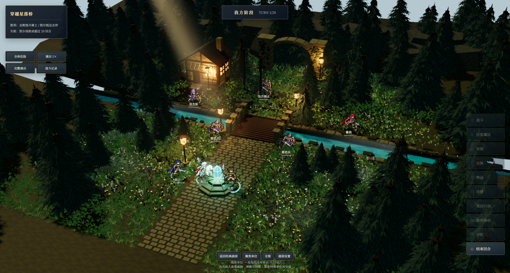
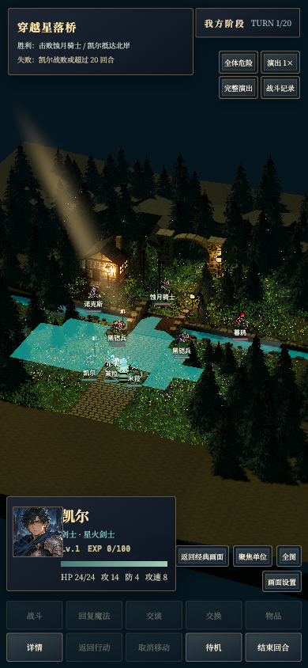

# 星落桥接入原游戏（2026-09-14）

星落桥现已在浏览器版《双星余烬》中默认使用与 Godot 工程同源的模型和基于六套人物制作的动画精灵，保留原有 10×8 战棋关卡与战役进度。并非另做一个只有移动功能的场景：移动、地形成本、攻击、生命施法、敌方 AI、招募、胜负、章节解锁及存档均继续使用原游戏系统。

## 启动与操作

在仓库根目录运行：

```sh
npm install
npm run dev -- --host 127.0.0.1 --port 4174 --strictPort
```

打开 http://127.0.0.1:4174/ 。已有进度使用“继续远征”；从世界地图进入星落桥会自动启用新场景。不同域名或端口的本地存档不共享。

1. 点击我方角色脚下的标记，点击亮起的棋格移动。
2. 行动菜单选择战斗、回复魔法、交谈、物品或待机；攻击仍先显示原战斗预测。
3. 使用“取消移动”回到行动前位置，“结束回合”交给原敌方 AI。
4. 拖动平移、滚轮或双指缩放；“全图”复位，“聚焦单位”定位角色。
5. “画面设置”调整昼夜、画质、雾、辉光及减少动态效果；“返回经典画面”随时回退，不改变单位状态。`?renderer=classic` 可强制经典画面进入。

## 接入范围

- 直接复用 `godot-starfall/assets/models/starfall_environment.glb` ，以 0.5 比例映射原棋盘；原六张人物 PNG 保留为素材基线。模型约 43 MB，首次加载需等待；未进行移动设备实机性能优化。
- 桥面、两岸、祭坛高度与角色落脚点对齐。棋格命中测试沿用原格坐标，遮挡角色的树冠和建筑局部淡出，移动和攻击范围显示于场景表面。
- 左上方真实方向光、物体投影、暖灯、动态水面、渐变天空与流云。浏览器光束使用深度测试的散射面片，云层为程序着色器，和 Godot Forward+ 的局部体积雾表现存在差异。
- 星落桥人物现使用六套、共 36 帧动画，包含待机、两帧步行、蓄力、出手和收势；回复施法也已补齐收势。莱拉和米菈已按新肖像更新长发女性造型。诺克斯使用紫色法师外观，原职业数值、招募规则仍不变。
- 月影峡道继续使用原 Three.js 地形；经典画面、世界地图、村庄及整备不变。
- 修复敌方回合结束后“我方可操作”早于地形恢复和存档完成的时序问题：恢复结束并保存后才解锁输入，避免立即刷新重跑敌方阶段。

素材源更新后执行 `npm run sync:starfall`，重新同步 GLB、PNG 和 SHA-256 清单。浏览器表现代码在 `src/presentation/three/StarfallEnvironment.ts`，原规则、关卡数据、存档和战役状态文件保持接入前哈希。

## 验证

`npm test`、`npm run build` 通过。自动检查包含素材同源、规则未改、坐标与桥面/祭坛对齐，以及桌面和 390×844 相机下全部 80 格可见。

实际 Tabbit 浏览器检查使用独立测试域名与战役夹具，没有覆盖通常游玩地址的存档：

- 移动、取消移动、移动后攻击；回复魔法治疗与 1 HP 消耗。
- 敌方回合推进、立即刷新恢复状态；经典画面来回切换保持单位数据一致。
- 80 个格中心逐一拾取，无坐标错位；390×844 竖屏选人及无横向溢出。
- 诺克斯交谈招募；凯尔北岸占领胜利、第二章解锁、返回世界；凯尔战败后重新出战。
- 四组固定随机数战斗：命中与追击、未命中、暴击击倒、骑兵施法消耗；旧舞台、新地图完整播放与跳过三个路径共 12 次结算一致，镜头和特效状态正确恢复。
- 第二关地图、80 格与原场景载入正常；最终检查无页面脚本错误。

实际结果见 [浏览器测试记录](starfall-play-evidence/browser-report.json)。可复跑的浏览器脚本为 `scripts/playtest-starfall.js` 和 `scripts/playtest-starfall-combat.js`（需通过 Tabbit CLI 在独立测试域名执行）。功能测试不等于跨设备性能基准；没有宣称对参考图实现像素级复现。




