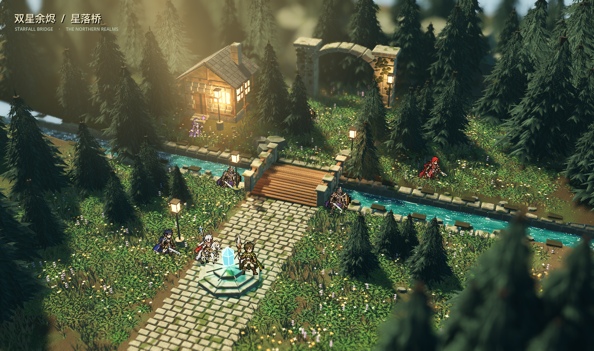
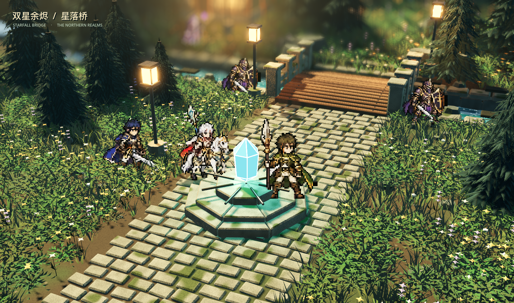
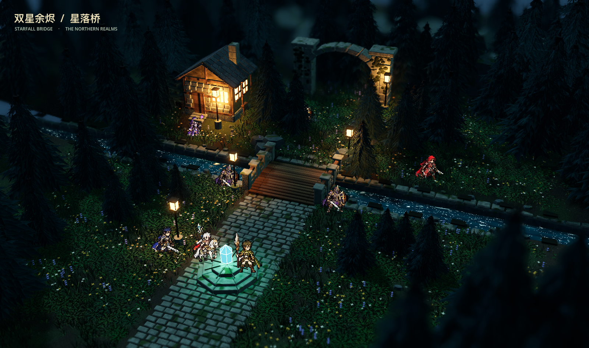

# 双星余烬 · 星落桥 / Blender → Godot

独立的第一关场景工程，使用 Blender 4.5 LTS 建模与制作贴图，Godot 4.6 Forward+ 实时渲染。保留原第一关 10×8 棋盘布局，角色使用参考图对应的新像素素材；本工程负责场景表现，未将浏览器版本的 TypeScript 战斗、AI 和存档迁移到 Godot。

## 在原游戏中游玩

此场景的 GLB 和六张人物素材已接入仓库根目录的浏览器版《双星余烬》，星落桥默认启用，沿用原有移动、战斗、招募、胜负与存档。运行根目录的 `npm run dev -- --host 127.0.0.1 --port 4174 --strictPort`，打开 http://127.0.0.1:4174/ 。[接入与验收说明](../docs/STARFALL-PLAYABLE.md)。本 Godot 工程仍用于场景制作和预览。

## 左上方阳光与动态天空（2026-09-14）

- 调整实际方向光，使阳光从画面左上方斜射树冠和石路；三束开启阴影的聚光灯配合局部体积雾，形成受树木遮挡的林间光束。经过两轮实机对照降低雾密度，保留桥与角色的清晰度。
- 新增 `shaders/moving_sky.gdshader`：渐变天空、暖色日晕、多尺度噪声云层、云体明暗与持续风向漂移。使用程序天空云层，不是体积云模拟。
- 默认保留参考图的俯视构图，天空在林梢空隙中显示；按 **4** 切换抬高的天空视角，完整查看流云，按 **1** 返回全景。按 **C** 暂停/恢复云层。按 **N** 切换冷色夜空，同时关闭日光束与左侧日光雾。
- 验证云层时间推进和暂停、四个相机预设、夜景关闭光束以及日景恢复；另录制 25 张固定相机的连续实机画面，在排除标题、地形与河水的纯天空区域核对像素变化。结果见 `evidence/sky-motion-verification.json` 与 `evidence/sky-verification.log`。
- 光照截图：[左上角林间阳光](evidence/05-sunshafts-day.png)；动态预览：[实际流云动图](evidence/07-moving-clouds.gif)；[夜空](evidence/06-sky-night.png)。本轮之前的截图保存在 `evidence/before-sky/`。

实现依据 Godot 的 [Sky shader 接口](https://docs.godotengine.org/en/stable/tutorials/shaders/shader_reference/sky_shader.html) 与 [FogVolume 局部体积雾](https://docs.godotengine.org/en/stable/classes/class_fogvolume.html)。

重新录制动态天空可从本目录执行：

```sh
/Applications/Godot.app/Contents/MacOS/Godot --path . --rendering-driver metal --resolution 1600x947 -- --capture-sky
```

## 继续打磨（2026-09-14）

本轮依据图 1 的「模型更新 → 资源检查 → Godot 验证 → 四视角实拍」流程，继续对照图 2 调整场景。图 1 的旧验收结果作为基线，本轮检查与截图重新执行。

- 松树改为折面针叶枝簇和下垂侧枝，增加树高、疏密与前景遮挡层次，校正偏绿的针叶颜色。
- 增加实例化草丛、完整花茎与叶片，修正植被顶点色的 sRGB 转换，消除过白草叶。
- 石路延伸至前景，加入尺寸、高度与旋转变化；补充桥栏砌石、小屋墙面石块、屋瓦厚度、拱门接缝和磨损倒角。
- 桥北岩石改为有断层的多面体，并移向通路两侧；祭坛改为分块台阶，水晶增加发光棱线。
- 调整木板、屋瓦、苔石与河水材质，收紧全景镜头，调整环境补光、接触阴影、薄雾和景深。昼夜切回日景后恢复相同环境颜色。

最终 Blender 模型：39 个网格、559,512 个三角形、31 张内嵌图片；Godot 另有实例化植被与远景森林。资源检查、场景验证及四视角实际运行通过，最终导入、场景构建、验证和渲染日志无错误。详细记录见 [本轮验收](evidence/polish-verification.json)，上轮四张实拍保存于 `evidence/before-polish/`。

实机截图位于本文末尾。树形重复、石材细微破损与林间柔光仍与参考图有差距。此次运行统计包含预热与相机切换，不作为性能基准；增加枝叶几何后也尚未进行跨设备性能测试。

## 打开与运行

本机可双击 `Open-Starfall.command` 直接预览。

用 Godot 导入本目录的 `project.godot`，打开 `scenes/starfall_bridge.tscn`，按 F6 或 F5 运行。第一次导入需要编译模型、纹理与着色器。macOS 可直接运行：

```sh
/Applications/Godot.app/Contents/MacOS/Godot --path "$PWD/godot-starfall" --rendering-driver metal
```

从仓库根目录执行上述命令。Blender 源工程为 `source/Starfall_Bridge.blend`，可直接打开修改。Godot 读取导出的 GLB，不依赖用户机器自动启动 Blender 导入。

| 按键 | 功能 |
| --- | --- |
| 1 / 2 / 3 / 4 | 全景 / 古桥细节 / 祭坛近景 / 天空流云 |
| C | 暂停或恢复云层漂移 |
| WASD / 鼠标拖动 | 平移场景镜头 |
| 滚轮 | 缩放 |
| N | 日光 / 月夜 |
| F | 景深开关 |
| G | 原始棋盘位置参考线 |
| H | 隐藏或显示标题 |
| Tab | 显示或隐藏操作提示 |
| Esc | 恢复全景 |

## 交付内容

- `source/Starfall_Bridge.blend`：可编辑的 Blender 场景，包含相机、日光与按语义分组的网格。
- `source/build_starfall.py`：确定性重建脚本，随机种子 17093。
- `assets/models/starfall_environment.glb`：合并重复材质后的真实 3D 地形、河岸、拱桥、森林、石路、小屋、废墟与祭坛；含 UV 与 PBR 纹理。
- `assets/textures/`：原创颜色、法线、粗糙度和针叶透明裁切贴图。颜色纹理采用 sRGB，数据纹理采用线性空间。
- `assets/sprites/`：保留原浏览器角色素材。
- `assets/sprites-hd2d/`：本轮生成并归一化的六种像素角色，供场景八个角色节点使用。生成记录见 `art-direction/pixel-cast-generation.md`。
- `assets/layout.json`：原地图的视觉布局与灯位置；不替代原游戏规则。
- `scenes/starfall_bridge.tscn`：Godot 场景，灯光、相机、河水、角色和环境均可单独编辑。
- `scripts/starfall.gd`、`scripts/meadow_detail.gd`、`shaders/`：相机、昼夜、像素角色、蕨类实例、苔石与地表着色、水流和萤火效果。
- `evidence/`：实际 Godot 运行截图、资源统计和验收结果。

## 重新生成

从本目录运行：

```sh
/Applications/Blender.app/Contents/MacOS/Blender --background --factory-startup --python source/build_starfall.py
/Applications/Godot.app/Contents/MacOS/Godot --headless --path . --editor --import
/Applications/Godot.app/Contents/MacOS/Godot --headless --path . --script res://scripts/import_pixel_cast.gd
/Applications/Godot.app/Contents/MacOS/Godot --headless --path . --editor --import
/Applications/Godot.app/Contents/MacOS/Godot --headless --path . --script res://scripts/build_scene.gd
/Applications/Godot.app/Contents/MacOS/Godot --headless --path . -- --verify
/Applications/Godot.app/Contents/MacOS/Godot --path . --rendering-driver metal --resolution 1600x1000 -- --capture
```

生成脚本会覆盖本工程对应的模型、贴图和 `starfall_bridge.tscn`；手工改动前请另存版本。原浏览器游戏、战斗规则和玩家存档不受影响。

## 美术与范围

参考 HD-2D 的微缩场景、像素角色与真实光照融合、前中后景、冷暖光比和浅景深，采用原创林间古桥构图。没有复制《八方旅人》的地图、角色、模型或贴图；本轮是可编辑的场景重建与实时演示，不宣称已经达到该作品的完整美术制作水平。

新增模型与纹理由本工程脚本原创生成；已有角色沿用项目 `docs/HD2D-ART.md` 的素材来源。系统字体使用 Godot / 操作系统的中文字体回退，不分发系统字体文件。

## 初版验收（2026-09-13，参考图改造前）

- Blender 4.5.12 LTS 实际生成并保存 `.blend`；纹理打包在源文件内，GLB 嵌入 31 张实际使用的图片。
- 最终环境为 33 个网格对象、80,135 个三角形、34 张独立源纹理。扩大了镜头外的背景森林，并合并重复材质减少提交。
- `python3 source/verify_assets.py` 通过：GLB 结构、内嵌贴图、全部网格 UV、树叶 alpha mask、场景资源存在性，以及 10×8 布局与原 `chapters.ts` 一致。
- Godot `--verify` 通过：8 个像素角色、6 个局部光源、相机预设返回及昼夜切换。
- Godot 4.6.3 / Forward+ / Metal / Apple M5 / macOS 26.6.2，1600×1000 实際窗口运行，四个视角截图保存成功。最终运行与正式验证日志没有脚本或渲染错误。
- `godot-runtime.json` 为约 508 帧的截图冒烟测量，包含视角切换；它不是预热 10 秒后的 60 秒性能基准，也不能代表其他设备。尚未测试 Windows、Linux、移动端或导出发行包。
- 原 19 个规则、状态、存档与数据文件 SHA-256 校验全部通过。本工程没有读写浏览器 localStorage。

## 参考图改造（2026-09-13）

以 `art-direction/starfall-hd2d-concept-v1.png` 为美术参考，修改的是可编辑 Blender 模型和 Godot 实时场景，没有把概念图铺成背景冒充三维场景。

- 八个场景角色改用六种新像素精灵，52–64 像素高、真实透明、最近邻采样和统一脚底锚点。保留原有位置与职业配色；目前是静止站姿。
- 重建多层针叶树冠、补充远景森林、花丛、碎石与实例化蕨类；修正枝片法线和 alpha mask，移开遮挡桥与祭坛的前景树。
- 小屋补充侧窗、窗框和山墙；桥岸增加石材层次，Godot 使用苔藓石材与斑驳地表着色器。
- 九个局部光源（五盏路灯、窗光、水晶光、两束林间阳光），冷色环境补光、暖灯、ACES 映射、克制泛光与前后景景深。N 切换夜景时关闭林间阳光。
- 动态河水含碎浪、沿岸泡沫、法线扰动与移动闪光。画幅改为接近参考图的 1600×947，默认只显示左上角标题，Tab 显示操作提示。

Blender 导出 38 个网格、172,094 个三角形、31 张内嵌图片与 34 张源纹理；Godot 另有实例化蕨类、远景复用森林及光效。资源检查验证了 UV、贴图、alpha mask 与原地图一致性。`--verify` 检查八个角色的尺寸/透明/采样、蕨类、远景森林、九个光源、昼夜和镜头复位。

当前画面仍是依据参考制作的实时重建，树木轮廓、地表密度和精细材质与生成图存在差异，不能称为逐像素一致。截图运行统计见 `evidence/godot-runtime.json`；包含编译预热与视角切换，不是独占 GPU 的性能基准。没有迁移原浏览器战斗逻辑、增加角色动画或进行发行包测试。

本轮之前的四张运行截图保存在 `evidence/before-reference-match/`。以下为更新后的 Godot 实机截图：






